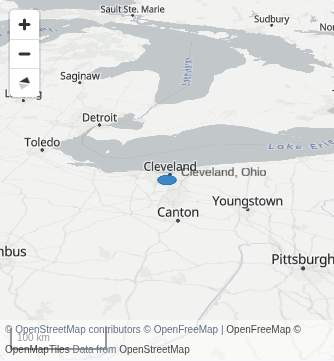
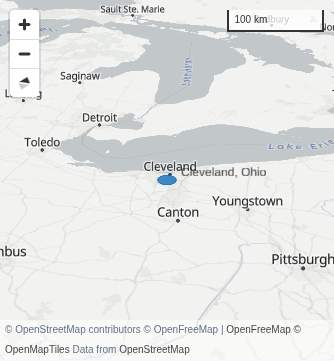
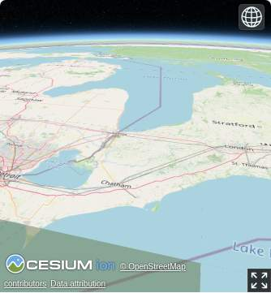
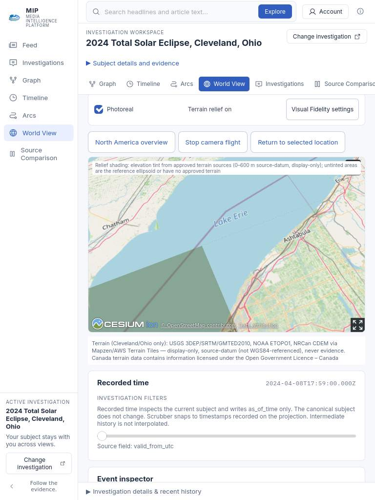
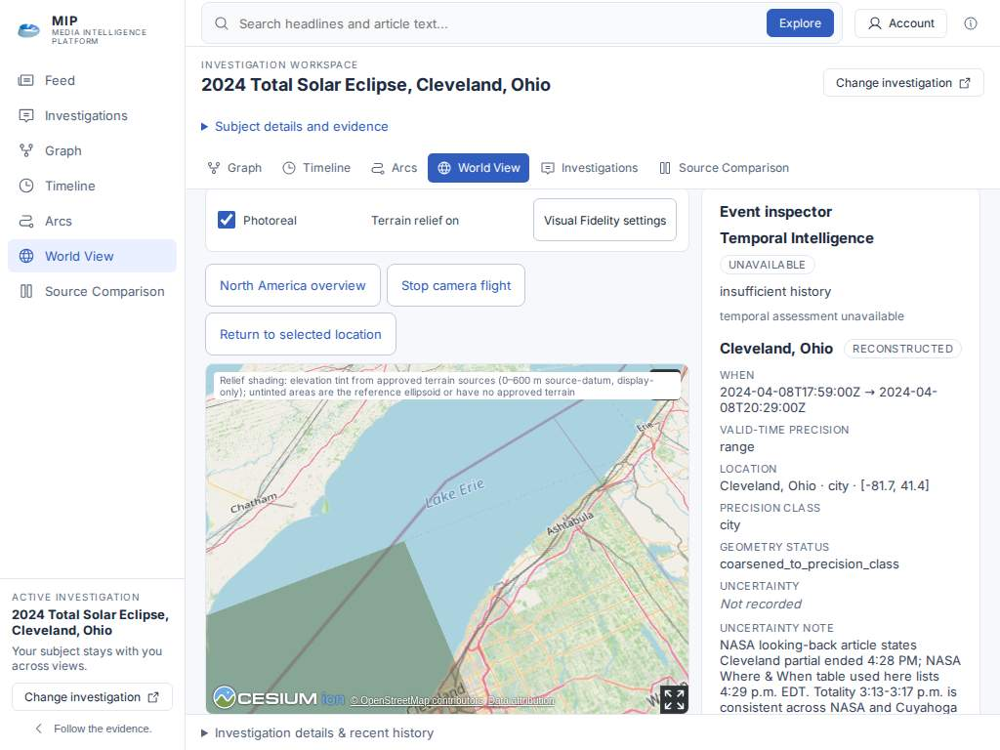

# World View controlled image evidence

Captured remotely in GitHub Actions job109724329456, successful run36663892554,
application source c5cd259e7c926720b93c93f21fa6480499852643. No local files.
Map imagery: [©OpenStreetMap contributors](https://www.openstreetmap.org/copyright).
Existing source/terrain disclosures are visible; this checkpoint precedes the
further visible-native-OSM-credit correction. These screenshots are evidence of
the labeled display effects, not environmental/weather observations.

| View | Evidence |
| --- | --- |
| Existing World View context (current scrolled viewport, not entire page/header) | [context](c5cd259e/context.jpg) |
| Cleveland nadir, relief/atmosphere/haze/sun off | [neutral](c5cd259e/cleveland-neutral.jpg) |
| Same nadir, only terrain relief on | [relief](c5cd259e/cleveland-relief.jpg) |
| Oblique, effects off | [neutral](c5cd259e/oblique-neutral.jpg) |
| Same oblique, only distance haze on | [haze](c5cd259e/oblique-haze.jpg) |

Local camera longitude−81.7°,latitude41.4°,height34,641.016m (recorded city floor).
Nadir heading0°,pitch−90°,roll0°; oblique heading346°,pitch−32°,roll0°.
Recorded event instant2024-04-08T17:59:00Z stayed frozen. Central raster comparisons:
nadir relief43.892/255 mean absolute RGB-channel delta; oblique relief45.051 and
haze3.215. All settled switches added zero terrain/imagery requests.
Renderer policy and camera stayed fixed; effects do not change evidence or precision.

## Responsive source and legibility evidence

These are representative built browsers in remote Actions, not hosted-preview or
deployed-live verification. Production source is identical across 2f6 and 1f5;
1f5 changes verification assertions and phone capture only. The full 1f5 fallback
job failed its pre-pick context oracle, so these individual passed observations
must not be described as a successful whole-job receipt.

| View | Source / job | Evidence |
| --- | --- | --- |
| Visible native OSM copyright and below-canvas terrain rights, desktop | 2f6dd7fded543a29262c9360f7985546028fa0c8 / 109730684044 | [desktop credits](2f6dd7fd/desktop-credits.jpg) |
| Actual 390×900 phone viewport with native copyright, terrain/Canada disclosure and recorded time | 1f5f5ce216630be1edb33b8faa3d8810a3ef7063 / 109734554710 | [phone credits](1f5f5ce2/phone-credits.jpg) |
| Static atlas, synthetic 500-member geometry of the original reader row; readable 11px main text | 1f5f5ce216630be1edb33b8faa3d8810a3ef7063 / 109734554710 | [dense atlas phone](1f5f5ce2/atlas-dense-phone.jpg) |

OSM views: [© OpenStreetMap contributors](https://www.openstreetmap.org/copyright).
Atlas: Natural Earth via world-atlas 110m. Synthetic geometry is acceptance data,
not observed or admitted evidence. All 500 members retain original point positions
and row access; one overlap label is displayed. Hidden full coordinate/status text
remains in the original accessible point name and inspector. No fine precision or
source coverage is implied.

Four engine/width combinations hit-tested native OSM links without a dialog and
confirmed no overlap with the terrain disclosure. These images preserve the
current scrolled view; the phone captures are actual viewports, not full pages.

## Qualified responsive and selection evidence — 59dcfea5

These 390 × 900 viewport images come from the actual built candidate `59dcfea572ff648eee8052dee7b516d6c6b0d52a`, World View Actions run [36670712678](https://github.com/jkelsen13-tech/media-intelligence-platform-v2/actions/runs/36670712678), successful refinement job `109744904020`. Weather also passed; the separate lifecycle job failed before inducing native context loss. This is representative built-browser evidence, not hosted-preview or production verification.

| Capture | What was observed |
| --- | --- |
| [Phone source credits](59dcfea5/phone-credits.jpg) | Native visible © OpenStreetMap contributors link and terrain source/Canada rights below the canvas, retained recorded time. |
| [Dense atlas phone](59dcfea5/atlas-dense-phone.jpg) | 500 original geometry members, one readable 11 CSS px label; original coordinates and full accessible names retained. |
| [Sparse atlas phone](59dcfea5/atlas-sparse-phone.jpg) | Five original geometry members, two readable 11 CSS px labels; actual viewport/stroke bounds and point centers retained. |

Atlas retained those counts across 1280 → 390 → 320 → 1280 widths. First Enter obeyed independently source-derived Investigation Context and exact deep-link serialization; only `as-of-time` and `selected-time-range` changed from the route seed. Repeated Space retained the same exact context/URL and all nine original inspector fields. This journey selects an already-selected original row; it does not prove a distinct-subject transition. Static background attribution is Natural Earth via world-atlas 110m. Fixture geometry is synthetic browser test context, never admitted evidence; source identity, revision, privacy/release and recorded-time fields stay original.

## Final qualified source: 1f8ed757

Source: `1f8ed7571379d5ebe96133aa5ef038836c2605d4`. [World View run 36676898743](https://github.com/jkelsen13-tech/media-intelligence-platform-v2/actions/runs/36676898743) and [Golden run 36676898741](https://github.com/jkelsen13-tech/media-intelligence-platform-v2/actions/runs/36676898741) succeeded. The built PR merge `716e2ef1138513cad10d02e124e97d99eefabdab` has zero file differences from this source head. These screenshots came from browser buffers in remote Actions and Git blobs authored in memory; no physical-device files were created.

### Phone fallback control correction

Both images use a 390×900 Chromium page with an actual 334×360 map viewport, after native context loss and restoration of the 100 km / heading 346° / pitch −32° / roll 0° display bridge. The before is historical source `20e8747bc4c466e2945531f36e0f743c17d2c78d`, lifecycle run 36675791404/job 109760342392. The after is the final source above, lifecycle job 109763697902. Source/time/evidence fields and camera remain qualified; the scale control changed its public placement.

| Before: scale overlaps expanded copyright | After: scale top-right, copyright expanded |
| --- | --- |
|  |  |

Ten actual MapLibre DOM snapshots in refinement job 109763697957 passed nonoverlap, viewport containment (0.75 px subpixel tolerance) and visible HTTPS provider-link checks: saved-camera 1280/390, dense and sparse 1280/390/320/1280. Scale-to-attribution gaps measured 288 px at 390 and 268 px at 320. Points, camera, precision and context were not moved by this layout change.

### Native-loss rendering evidence

The corresponding fallback is the after image above. Native `WEBGL_lose_context` delivered a trusted loss event on the already rendered globe, followed by one actual MapLibre handoff, zero draw-failure diagnostics and zero page errors; the old canvas disconnected. The test also passed at 1280 px. This simulates browser context loss, not physical GPU failure. The globe and MapLibre use different imagery and camera representations; this pair proves recovery and registered display-bridge state, not identical optical framing or a color-treatment comparison.

### Tablet-sized shared-shell evidence

| WebKit 768×1024 portrait | Chromium 1024×768 landscape |
| --- | --- |
|  |  |

Both are viewport captures from tablet job 109763697897, at the manual 150 km / heading 23° / pitch −65° / roll 0° pose after orientation restoration and before the separate VF/touch exercise. Portrait shows native OSM credit and the full below-canvas terrain disclosure; landscape retains the disclosure below the viewport for scrolling. Existing relief tint is displayed and labeled; its palette was not changed by this wave.

All four Chromium/WebKit × portrait/landscape journeys passed exact original-row fields, recorded context/URL, camera restoration, raw floors, actual FXAA/master behavior, credit hit testing and settled zero-frame windows. Actual trusted tap start/end and UI response qualified both engines. Chromium additionally exercised trusted drag with camera change and no page scroll. WebKit `maxTouchPoints: 0` was recorded honestly despite actual trusted taps; WebKit drag, physical iPad/Safari hardware, native multitouch and hardware performance remain unqualified.

These images are **representative built Actions evidence**. Hosted-preview and deployed/live MIP verification are **NOT YET EXERCISED**; this draft/unmerged candidate was not deployed merely to test.
